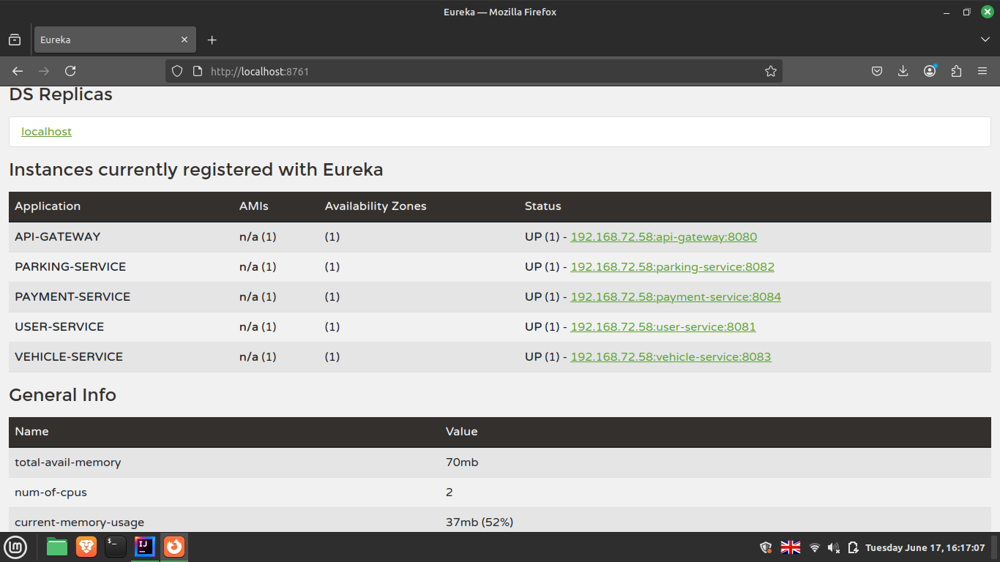

# Smart Parking Management System (SPMS)

A microservice-based Smart Parking Management System developed using Spring Boot, Spring Cloud, and Eureka Discovery Server. The system includes the following services:

- **User Service** (port: 8081)
- **Vehicle Service** (port: 8083)
- **Parking Space Service** (port: 8084)
- **Payment Service** (port: 8085)
- **Eureka Discovery Server** (port: 8761)
- **API Gateway** (port: 8080)

## 🔧 Technologies Used

- Java 17+
- Spring Boot
- Spring Cloud Eureka
- Spring Cloud Gateway
- Maven
- Lombok
- Postman (for testing)
- Eureka Dashboard

## 🧩 Microservices Overview

### ✅ User Service
Handles user registration, retrieval, and deletion.

| Endpoint              | Method | Description             |
|-----------------------|--------|-------------------------|
| `/api/users`          | POST   | Register new user       |
| `/api/users/{id}`     | GET    | Get user by ID          |
| `/api/users`          | GET    | Get all users           |
| `/api/users/{id}`     | DELETE | Delete user by ID       |

### 🚗 Vehicle Service
Manages vehicle registration and parking simulation.

| Endpoint                           | Method | Description                        |
|------------------------------------|--------|------------------------------------|
| `/vehicles`                        | POST   | Register new vehicle               |
| `/vehicles/{id}`                   | PUT    | Update vehicle                     |
| `/vehicles/{id}`                   | GET    | Get vehicle by ID                  |
| `/vehicles/owner/{ownerId}`        | GET    | Get vehicles by owner ID           |
| `/vehicles/entry/{licensePlate}`   | POST   | Simulate vehicle entry             |
| `/vehicles/exit/{licensePlate}`    | POST   | Simulate vehicle exit              |

### 🅿️ Parking Space Service
Manages available parking spaces and their metadata.

| Endpoint                          | Method | Description                        |
|-----------------------------------|--------|------------------------------------|
| `/api/parking`                    | POST   | Create parking space               |
| `/api/parking/{id}`               | PUT    | Update parking space               |
| `/api/parking/{id}`               | GET    | Get parking space by ID            |
| `/api/parking/owner/{ownerId}`    | GET    | Get parking spaces by owner        |
| `/api/parking`                    | GET    | Get all parking spaces             |
| `/api/parking/{id}`               | DELETE | Delete parking space               |

### 💳 Payment Service
Processes parking payments.

| Endpoint                   | Method | Description                |
|----------------------------|--------|----------------------------|
| `/api/payments`           | POST   | Make a payment             |
| `/api/payments/user/{id}` | GET    | Get payments by user ID    |

---

## 📬 Postman Collection

Test all endpoints easily using the provided Postman collection:

👉 [Postman Collection](./postman_collection.json)

To use:
1. Open Postman
2. Import the `postman_collection.json` file from the project root.
3. Run individual requests or organize into a collection runner.

---

## 📸 Eureka Dashboard Screenshot

Shows all microservices registered with Eureka:

---

## 📂 Project Structure

smart-parking-system/
├── eureka-server/
├── gateway-service/
├── user-service/
├── vehicle-service/
├── parking-service/
├── payment-service/
├── docs/
│ └── screenshots/
│ └── eureka_dashboard.png
├── postman_collection.json
└── README.md

---

## 🚀 How to Run

1. Start **Eureka Server** (`eureka-server` on port `8761`)
2. Start **API Gateway** (`gateway-service` on port `8080`)
3. Start other services (`user-service`, `vehicle-service`, etc.)
4. Use Postman to test endpoints via gateway or directly.

---

## 📞 Contact

Created by tharindu randika  
Feel free to reach out for contributions, issues, or improvements!
